# DSA 2040 Practical Exam - Data Warehousing and Data Mining
---
## Project Overview

This project demonstrates a complete end-to-end data workflow using a synthetic retail dataset. It covers data warehousing, ETL processes, OLAP analysis, and data mining tasks. The goal is to simulate a real-world data analytics pipeline and generate actionable insights from structured retail data.

---

### Key Components

1. **Data Warehousing**
   - Design and implementation of a star-schema data warehouse.
   - Schema and initial datasets stored in `Section1_Data_Warehousing`.

2. **ETL Process**
   - Extraction, transformation, and loading of synthetic retail data into the data warehouse.
   - ETL notebooks and processed data located in `Section2_ETL_process`.

3. **OLAP Queries & Analysis**
   - Online Analytical Processing (OLAP) queries to analyze sales data.
   - Query outputs and visualizations saved in `Section3_OLAP_Queries_Analysis`.

4. **Data Mining**
   - Preprocessing, clustering, and classification tasks on sample datasets (e.g., Iris and retail transaction data).
   - Notebooks and visualizations found in `Section4_Data_Mining`.

### Datasets
- Synthetic retail sales data: `Section2_ETL_process/data/synthetic_retail_data.csv`
- Retail data warehouse: `retail_dw.db`
- Iris dataset (preprocessed) for clustering and classification tasks.

### Objectives
- Build a fully functional data warehouse.
- Demonstrate ETL and OLAP workflows.
- Perform exploratory data analysis and mining to extract insights.
- Generate visualizations for easier interpretation of results.

---

### Repository structure


- LICENSE
- README.md

- Section1_Data_Warehousing
    - dw_schema.sql
    - retail_dw.db
    - retail_star_schema.drawio.png

- Section2_ETL_process
    - etl_process.log
    - etl_retail.ipynb
    - retail_dw.db
    - data/
        - synthetic_retail_data.csv
        - transformed_retail_data.csv
    - retail_tableoutputs_load/
        - customerdimtable.PNG
        - sales_facttable.PNG
        - time_dimtable.PNG

- Section3_OLAP_Queries_Analysis
    - OLAP Queries Analysis Report.pdf
    - olap_queries.ipynb
    - olap_queries.sql
    - retail_dw.db
    - queries_results/
        - drilldown_sales_uk_month.csv
        - rollup_sales_by_country_quarter.csv
        - slice_sales_electronics.csv
    - queries_visualizations/
        - monthlysales_australia.png
        - salesbycountrybyquarter.png
        - total_electronic_sales.png

- Section4_Data_Mining
    - task1_prep_explore/
        - iris_preprocessed.csv
        - preprocessing_iris.ipynb
        - Visualizations_eda/
            - boxplots_iris.png
            - correlation_iris.png
            - pairplot_iris.png
    - task2_clustering/
        - clustering_iris.ipynb
        - visualizations_clustering/
            - elbow_method.png
            - kmeans3_clustering.png
    - task3_mining/
        - decision_tree_classifier.png
        - mining_iris_basket.ipynb
        - synthetic_transactions.csv

---

## How to Run

---

### 1. Clone the Repository

```bash
git clone <your-repo-url>
cd <your-repo-folder>
```

---

### 2. Install Dependencies
```bash
pip install -r requirements.txt
```

Required libraries include:

- Python 3.x

- pandas, numpy, scikit-learn, matplotlib, seaborn

- sqlite3

- mlxtend (for association rule mining)

- jupyter (optional, to run notebooks)

---


### 3. Database Setup

If using the provided SQLite database:

```bash
sqlite3 Section1_Data_Warehousing/retail_dw.db

```


---

### 4. Run ETL Process

```bash
python Section2_ETL_process/etl_retail.ipynb

```

---

### 5. OLAP Queries

Run SQL queries directly:

```bash
sqlite3 Section1_Data_Warehousing/retail_dw.db < Section3_OLAP_Queries_Analysis/olap_queries.sql

```

Or open and execute the notebook:

```bash
jupyter notebook Section3_OLAP_Queries_Analysis/olap_queries.ipynb

```

---

### 6. Data Mining Tasks

Run notebooks or scripts in order:

```bash
python Section4_Data_Mining/task1_prep_explore/preprocessing_iris.py
python Section4_Data_Mining/task2_clustering/clustering_iris.py
python Section4_Data_Mining/task3_mining/mining_iris_basket.py

```

---

## Self-Assessment

### Tasks Completed
- **Data Warehousing**
  - Designed and implemented a star schema with fact and dimension tables.
  - Loaded synthetic retail data into SQLite database.
  - Performed ETL process with data validation and logging.
- **OLAP Analysis**
  - Executed roll-up, drill-down, and slice queries.
  - Generated visualizations for sales trends.
  - Analyzed insights from the warehouse.
- **Data Mining**
  - Preprocessed Iris dataset: normalization, encoding, outlier checks.
  - Explored data with summary statistics, pairplots, and heatmaps.
  - Performed K-Means clustering, visualized clusters, and evaluated using ARI.
  - Trained Decision Tree and KNN classifiers, compared performance.
  - Generated synthetic transaction data and applied Apriori for association rules.

### Struggles Encountered
- Handling missing or inconsistent data during ETL required careful cleaning.
- Designing realistic synthetic datasets that mimic actual retail data was challenging.
- Debugging SQL queries and ensuring database integrity took additional iterations.
- Fine-tuning clustering and classification models to achieve meaningful results.

### Improvements Made
- Added detailed logging in ETL to track row processing and errors.
- Enhanced visualizations with clear labels and insights for easier interpretation.
- Structured notebooks with modular functions to allow reusability.
- Used reproducible random seeds for synthetic data to ensure consistent results.

### Overall Reflection
This project allowed applying theoretical knowledge into a practical end-to-end data workflow. While generating synthetic datasets posed challenges, it improved understanding of data preparation, modeling, and analysis pipelines. The final submission includes working scripts, notebooks, generated datasets, visualizations, and reports, demonstrating a complete data warehousing and mining solution.

---


## Section 1: Data Warehousing
### Project  Overview

This task involved designing a data warehouse star schema for a retail company that sells products across various categories, including electronics and clothing. The company tracks sales transactions, customer details, product information, and time data.

The objective was to create a data model that supports key analytical queries such as total sales by product category per quarter, customer demographic analysis, and inventory trend tracking.

### Task 1: Data Warehouse Design

#### Star Schema Explanation

The chosen design is a **star schema** consisting of one fact table (`fact_sales`) and four dimension tables (`dim_customer`, `dim_product`, `dim_store`, and `dim_time`).

#####  Fact Table

- **fact_sales**: Captures measurable sales data including sales amount and quantity, and links to dimensions through foreign keys (`customer_id`, `product_id`, `time_id`, `store_id`).

##### Dimension Tables

- **dim_customer**: Contains customer attributes such as customer ID, name, gender, age, and location.
- **dim_product**: Stores product details like product ID, name, category, and brand.
- **dim_store**: Holds store-related information such as store ID, name, and location.
- **dim_time**: Records time information including date, quarter, and year for time-based analysis.

---

## Why Star Schema?

The star schema was selected over a snowflake schema for the following reasons:

- It simplifies querying and improves performance due to fewer joins.
- It provides a clear, intuitive structure for business users and analysts.
- It aligns well with the retail company's need for fast aggregation and reporting on sales and customer demographics.

---

## Schema Diagram
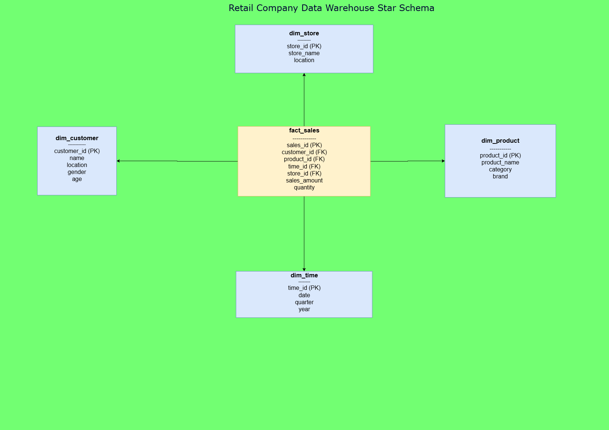
---

### SQL Schema Script

- The SQL script file `dw_schema.sql` includes all the `CREATE TABLE` statements required to build the schema.

```bash
CREATE TABLE dim_customer (
    customer_id INTEGER PRIMARY KEY,
    name TEXT,
    location TEXT,
    gender TEXT,
    age INTEGER
);

CREATE TABLE dim_product (
    product_id INTEGER PRIMARY KEY,
    product_name TEXT,
    category TEXT,
    brand TEXT
);

CREATE TABLE dim_store (
    store_id INTEGER PRIMARY KEY,
    store_name TEXT,
    location TEXT
);

CREATE TABLE dim_time (
    time_id INTEGER PRIMARY KEY,
    date TEXT,
    quarter TEXT,
    year INTEGER
);

CREATE TABLE fact_sales (
    sales_id INTEGER PRIMARY KEY,
    customer_id INTEGER,
    product_id INTEGER,
    time_id INTEGER,
    store_id INTEGER,
    sales_amount REAL,
    quantity INTEGER,
    FOREIGN KEY (customer_id) REFERENCES dim_customer(customer_id),
    FOREIGN KEY (product_id) REFERENCES dim_product(product_id),
    FOREIGN KEY (time_id) REFERENCES dim_time(time_id),
    FOREIGN KEY (store_id) REFERENCES dim_store(store_id)
);

```

- To create the schema in SQLite, run:

  ```bash
  sqlite3 retail_dw.db < dw_schema.sql
  ```

- This will set up the tables and constraints needed for the data warehouse.

---

# ETL Retail Data Project

## Overview

This project performs a full **ETL (Extract, Transform, Load)** process on a synthetic retail dataset. The ETL pipeline is implemented in Python and stores the cleaned and aggregated data into a **SQLite database** (`retail_dw.db`). All steps of the process are **logged** in `etl_process.log`, including the number of rows processed at each stage.

---

## Project Contents

- **etl_retail.py** (or `etl_retail.ipynb`): Python script or notebook containing the Etl Process ETL function and logging configuration.  
- **data folder** 
this contains the extract simulated data and transformed data:

- **synthetic_retail_data.csv**: Input CSV dataset (used for extraction).

***Sample Output***
```
InvoiceNo,StockCode,Description,Quantity,InvoiceDate,UnitPrice,CustomerID,Country
INV10629,P5569,It Of,45,2025-06-30 03:26:14,5.41,10089.0,United Kingdom
INV10788,P1423,Live Eight,35,2024-08-05 19:57:11,74.23,10062.0,Canada
INV10684,P8933,Unit Example,45,2023-12-01 22:12:30,66.75,10063.0,Australia
INV10516,P2020,Fill Relationship,1,2024-12-12 00:34:30,56.25,10034.0,Netherlands
INV10529,P9947,Though Could,24,2024-03-12 10:59:29,38.15,10023.0,Australia
INV10657,P1282,Occur Evidence,5,2025-01-19 03:15:43,49.95,10006.0,France
INV10552,P1823,What Follow,35,2025-02-14 15:01:34,3.88,10060.0,France
INV10531,P8999,Beyond Next,50,2023-09-22 01:26:54,52.89,10095.0,United Kingdom
```

- **transformed_retail_data.csv** (optional): CSV output containing transformed sales data. 

***Sample Output***

```
InvoiceNo,StockCode,Description,Quantity,InvoiceDate,UnitPrice,CustomerID,Country,TotalSales
INV10629,P5569,It Of,45,2025-06-30 03:26:14,5.41,10089,United Kingdom,243.45000000000002
INV10516,P2020,Fill Relationship,1,2024-12-12 00:34:30,56.25,10034,Netherlands,56.25
INV10657,P1282,Occur Evidence,5,2025-01-19 03:15:43,49.95,10006,France,249.75
INV10552,P1823,What Follow,35,2025-02-14 15:01:34,3.88,10060,France,135.79999999999998
INV10321,P5533,Push Start,14,2024-10-21 19:53:14,32.44,10065,France,454.15999999999997
INV10070,P5422,Risk Officer,18,2025-04-06 08:08:33,17.08,10033,Canada,307.43999999999994
INV10668,P7971,Executive Power,7,2024-08-25 00:55:00,72.28,10034,Netherlands,505.96000000000004
INV10247,P9883,Magazine Part,29,2025-07-16 04:39:19,38.47,10018,USA,1115.6299999999999
INV10613,P8102,Professor Forget,7,2025-02-06 04:05:45,93.8,10013,Germany,656.6

```


- **retail_dw.db**: SQLite database created by the ETL script containing the following tables:  
  - `CustomerDim` — Customer dimension table.  
  - `TimeDim` — Time dimension table.  
  - `SalesFact` — Fact table with sales records.

**Screenshots of a sample of the contents in this data base tables**
(a) Customer Dimension Table

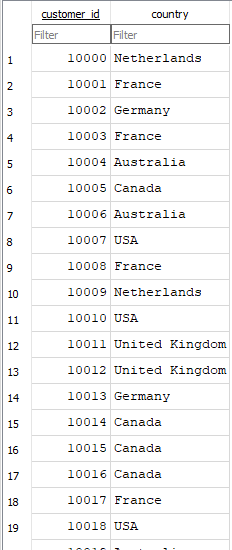

(b) Sales Fact Table

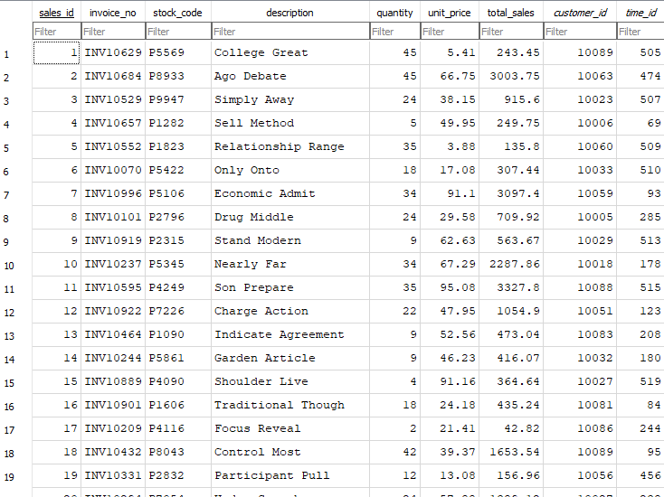

(c)Time Dimension Table

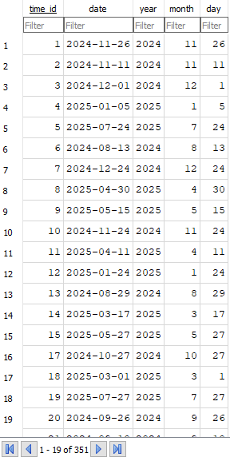


- **etl_process.log**: Log file containing detailed information about rows processed, transformations applied, and records inserted.

---
# ETL Process
The ETL was developed in two phases:

1. **Stepwise Execution:** The Extraction, Transformation, and Load steps were first implemented and tested separately to ensure data quality and correctness.  
2. **Function Encapsulation:** After verification, the ETL steps were combined into a single function `run_etl()` for easier execution, logging, and reusability.

---

## Step Wise Execution

---

# Step 0: Synthetic Data Generation

### Step 0: Synthetic Data Generation with Real-World Imperfections

In this step, we generate a synthetic retail dataset (~1100 rows) designed to resemble real-world data by including:

- Valid sales records with random realistic values.
- Outliers: negative or zero quantities and unit prices to simulate data entry errors.
- Duplicate records to represent accidental repeated entries.
- Missing values in some columns to mimic incomplete data.

After generation, the dataset is saved as `synthetic_retail_data.csv` to simulate an extraction source file for the ETL process.
*** Code Used ***

```python
# Import necessary libraries
import pandas as pd
import numpy as np
import random
from faker import Faker

# Initialize Faker for realistic data generation
fake = Faker()

# Set random seed for reproducibility
random.seed(42)
np.random.seed(42)

# Define parameters
num_rows = 1000
num_customers = 100
num_countries = 7

# Generate InvoiceNo as unique invoice strings
invoice_numbers = [f"INV{10000 + i}" for i in range(num_rows)]

# Generate StockCode as product codes
stock_codes = [f"P{random.randint(1000,9999)}" for _ in range(num_rows)]

# Generate product descriptions
products = [fake.word().capitalize() + " " + fake.word().capitalize() for _ in range(num_rows)]

# Quantities: integers 1 to 50, with some negative values as outliers
quantities = np.random.randint(1, 51, size=num_rows)
outlier_indices = np.random.choice(num_rows, size=10, replace=False)
quantities[outlier_indices] = -np.random.randint(1, 20, size=10)  # negative quantities as outliers

# UnitPrice: floats between 1 and 100, with some zero or negative outliers
unit_prices = np.round(np.random.uniform(1, 100, size=num_rows), 2)
price_outlier_indices = np.random.choice(num_rows, size=5, replace=False)
unit_prices[price_outlier_indices] = np.random.uniform(-20, 0, size=5)  # negative or zero prices as outliers

# InvoiceDate: random dates over 2 years (Aug 12, 2023 to Aug 12, 2025)
start_date = pd.Timestamp('2023-08-12')
end_date = pd.Timestamp('2025-08-12')
invoice_dates = [fake.date_time_between(start_date, end_date) for _ in range(num_rows)]

# CustomerID: Use float type array to allow NaNs
customer_ids = np.random.choice(range(10000, 10000 + num_customers), size=num_rows).astype(float)

# Country: random selection from 7 countries
countries_list = ['United Kingdom', 'France', 'Germany', 'Netherlands', 'USA', 'Canada', 'Australia']
countries = np.random.choice(countries_list, size=num_rows)

# Introduce some missing CustomerID and Description values randomly
missing_customer_indices = np.random.choice(num_rows, size=20, replace=False)
for i in missing_customer_indices:
    customer_ids[i] = np.nan  # Now valid as customer_ids are floats

missing_description_indices = np.random.choice(num_rows, size=15, replace=False)
for i in missing_description_indices:
    products[i] = None

# Create DataFrame
df_synthetic = pd.DataFrame({
    'InvoiceNo': invoice_numbers,
    'StockCode': stock_codes,
    'Description': products,
    'Quantity': quantities,
    'InvoiceDate': invoice_dates,
    'UnitPrice': unit_prices,
    'CustomerID': customer_ids,
    'Country': countries
})

# Add some duplicate rows by duplicating random samples
duplicates = df_synthetic.sample(10, random_state=42)
df_synthetic = pd.concat([df_synthetic, duplicates], ignore_index=True)

# Shuffle the dataset
df_synthetic = df_synthetic.sample(frac=1, random_state=42).reset_index(drop=True)

# Save the generated dataset to CSV for extraction stage
df_synthetic.to_csv('synthetic_retail_data.csv', index=False)

print("Synthetic dataset generated and saved as 'synthetic_retail_data.csv'.")
print(f"Dataset shape: {df_synthetic.shape}")
print(f"Number of duplicates: {df_synthetic.duplicated().sum()}")
print(f"Number of missing CustomerID: {df_synthetic['CustomerID'].isna().sum()}")
print(f"Number of missing Description: {df_synthetic['Description'].isna().sum()}")

```

---


# Set Up the Logger

```python
import pandas as pd
import logging
import sys

# ------------------ Logger Setup ------------------
logger = logging.getLogger("ETLLogger")
logger.setLevel(logging.INFO)

# Prevent multiple handlers in notebooks
if not logger.handlers:
    # File handler
    file_handler = logging.FileHandler("etl_process.log", mode='a')  # append logs
    file_handler.setLevel(logging.INFO)
    formatter = logging.Formatter('%(asctime)s - %(levelname)s - %(message)s')
    file_handler.setFormatter(formatter)
    logger.addHandler(file_handler)

    # Console handler
    console_handler = logging.StreamHandler(sys.stdout)
    console_handler.setLevel(logging.INFO)
    console_handler.setFormatter(formatter)
    logger.addHandler(console_handler)

logger.info("Logger initialized successfully")

```

- Our logger was initilized successfully

---

# Step 1: Extract

- In this step, we read the synthetic CSV data generated previously into a pandas DataFrame. 
- We will handle missing values and data types (convert InvoiceDate to datetime).
- This prepares the raw data for transformation.

*** Code Used ***

```python
logger.info("ETL Process started - Extraction step")

# Load synthetic CSV dataset
df = pd.read_csv('synthetic_retail_data.csv')

# Convert InvoiceDate to datetime format for time-based operations
df['InvoiceDate'] = pd.to_datetime(df['InvoiceDate'], errors='coerce')

# Drop rows where critical columns have missing values
missing_before = df.shape[0]
df = df.dropna(subset=['CustomerID', 'Description'])
missing_after = df.shape[0]
logger.info(f"Dropped {missing_before - missing_after} rows due to missing CustomerID or Description")

# Remove duplicate rows
duplicates_before = df.shape[0]
df = df.drop_duplicates()
duplicates_after = df.shape[0]
logger.info(f"Removed {duplicates_before - duplicates_after} duplicate rows")

# Ensure proper data types
df['Quantity'] = pd.to_numeric(df['Quantity'], errors='coerce').fillna(0).astype(int)
df['UnitPrice'] = pd.to_numeric(df['UnitPrice'], errors='coerce').fillna(0.0).astype(float)
df['CustomerID'] = pd.to_numeric(df['CustomerID'], errors='coerce').astype('Int64')

logger.info(f"Extracted data shape after cleaning: {df.shape}")
logger.info(f"Missing values after cleaning:\n{df.isna().sum()}")

# Optional: show first 5 rows
print(df.head())

```

*** Our output ***
Output Analysis:

-  The dataset was successfully loaded from the CSV file.
-  InvoiceDate was converted to datetime format for easier filtering later.
-  The dataset contains missing CustomerID and Description values, as expected from the synthetic generation.
-  There are also duplicate rows, which will be handled during transformation.
## Extraction Step Outputs

| Timestamp                  | Log Message |
|-----------------------------|------------|
| 2025-08-13 09:29:30,395    | ETL Process started - Extraction step |
| 2025-08-13 09:29:30,419    | Dropped 35 rows due to missing CustomerID or Description |
| 2025-08-13 09:29:30,428    | Removed 10 duplicate rows |
| 2025-08-13 09:29:30,435    | Extracted data shape after cleaning: (965, 8) |
| 2025-08-13 09:29:30,444    | Missing values after cleaning: <br>InvoiceNo: 0, StockCode: 0, Description: 0, Quantity: 0, InvoiceDate: 0, UnitPrice: 0, CustomerID: 0, Country: 0 |

### Sample Extracted Data (First 5 Rows)

| InvoiceNo | StockCode | Description        | Quantity | InvoiceDate          | UnitPrice | CustomerID | Country        |
|-----------|-----------|------------------|----------|--------------------|-----------|------------|----------------|
| INV10629  | P5569     | It Of            | 45       | 2025-06-30 03:26:14 | 5.41      | 10089      | United Kingdom |
| INV10788  | P1423     | Live Eight       | 35       | 2024-08-05 19:57:11 | 74.23     | 10062      | Canada         |
| INV10684  | P8933     | Unit Example     | 45       | 2023-12-01 22:12:30 | 66.75     | 10063      | Australia      |
| INV10516  | P2020     | Fill Relationship | 1       | 2024-12-12 00:34:30 | 56.25     | 10034      | Netherlands   |
| INV10529  | P9947     | Though Could     | 24       | 2024-03-12 10:59:29 | 38.15     | 10023      | Australia      |

---

## Step 2.1: Save Transformed Data to CSV
- After cleaning and transforming the data (calculating TotalSales, filtering, etc.),
- we save the resulting DataFrame to a CSV file named 'transformed_retail_data.csv'. as seen above
- This allows for easy data sharing and serves as an intermediate checkpoint.

---

# Step 3: Load (Inserting Data into SQLite Database)

In this step, we will load the transformed retail data into a SQLite database named `retail_dw.db`.

We will create three tables:
- `CustomerDim` to store unique customers,
- `TimeDim` to store unique dates and time attributes,
- `SalesFact` to store the sales transactions linked to the customer and time dimensions via foreign keys.

This design follows the data warehousing star schema pattern and satisfies the project requirement to load data into a fact table and at least two dimension tables.

*** Code Used ***

```python
import sqlite3
import pandas as pd
import logging

# Logger assumed already configured at the start of your script

logger.info("Load step started")

# Connect or create SQLite DB
conn = sqlite3.connect('retail_dw.db')
cursor = conn.cursor()

# Create dimension and fact tables if not exist
cursor.execute('''
CREATE TABLE IF NOT EXISTS CustomerDim (
    customer_id INTEGER PRIMARY KEY,
    country TEXT
)
''')

cursor.execute('''
CREATE TABLE IF NOT EXISTS TimeDim (
    time_id INTEGER PRIMARY KEY AUTOINCREMENT,
    date TEXT UNIQUE,
    year INTEGER,
    month INTEGER,
    day INTEGER
)
''')

cursor.execute('''
CREATE TABLE IF NOT EXISTS SalesFact (
    sales_id INTEGER PRIMARY KEY AUTOINCREMENT,
    invoice_no TEXT,
    stock_code TEXT,
    description TEXT,
    quantity INTEGER,
    unit_price REAL,
    total_sales REAL,
    customer_id INTEGER,
    time_id INTEGER,
    FOREIGN KEY(customer_id) REFERENCES CustomerDim(customer_id),
    FOREIGN KEY(time_id) REFERENCES TimeDim(time_id)
)
''')

conn.commit()
logger.info("Tables created or verified")

# Insert unique customers into CustomerDim
customers = df[['CustomerID', 'Country']].drop_duplicates().dropna()
customers.columns = ['customer_id', 'country']

for _, row in customers.iterrows():
    cursor.execute('''
        INSERT OR IGNORE INTO CustomerDim (customer_id, country) VALUES (?, ?)
    ''', (int(row['customer_id']), row['country']))
conn.commit()
logger.info(f"Inserted {customers.shape[0]} customers into CustomerDim")

# Insert unique dates into TimeDim
dates = df[['InvoiceDate']].drop_duplicates()
dates['year'] = dates['InvoiceDate'].dt.year
dates['month'] = dates['InvoiceDate'].dt.month
dates['day'] = dates['InvoiceDate'].dt.day
dates['date_str'] = dates['InvoiceDate'].dt.strftime('%Y-%m-%d')

for _, row in dates.iterrows():
    cursor.execute('''
        INSERT OR IGNORE INTO TimeDim (date, year, month, day) VALUES (?, ?, ?, ?)
    ''', (row['date_str'], row['year'], row['month'], row['day']))
conn.commit()
logger.info(f"Inserted {dates.shape[0]} dates into TimeDim")

# Get time_id mapping safely
time_map_df = pd.read_sql_query("SELECT time_id, date FROM TimeDim", conn)
time_map_df.rename(columns={'date':'date_str'}, inplace=True)

# Prepare merge keys
df['date_str'] = df['InvoiceDate'].dt.strftime('%Y-%m-%d')

# Drop any existing 'time_id' columns to avoid suffix issues
if 'time_id' in df.columns:
    df.drop(columns=['time_id'], inplace=True)

# Merge df with time_map_df on 'date_str'
df = df.merge(time_map_df, how='left', on='date_str')

# Check for missing time_id after merge
missing_time_ids = df['time_id'].isna().sum()
if missing_time_ids > 0:
    logger.warning(f"{missing_time_ids} records have missing time_id after merge and will be skipped.")

# Insert sales records, skipping rows with missing foreign keys
sales_inserted = 0
for _, row in df.iterrows():
    if pd.isna(row['CustomerID']) or pd.isna(row['time_id']):
        continue  # Skip rows with missing keys
    
    cursor.execute('''
        INSERT INTO SalesFact (
            invoice_no, stock_code, description, quantity, unit_price, total_sales, customer_id, time_id
        ) VALUES (?, ?, ?, ?, ?, ?, ?, ?)
    ''', (
        row['InvoiceNo'],
        row['StockCode'],
        row['Description'],
        int(row['Quantity']),
        float(row['UnitPrice']),
        float(row['TotalSales']),
        int(row['CustomerID']),
        int(row['time_id'])
    ))
    sales_inserted += 1

conn.commit()
logger.info(f"Inserted {sales_inserted} sales records into SalesFact")

# Optional: Print counts to console
for table in ['CustomerDim', 'TimeDim', 'SalesFact']:
    cursor.execute(f"SELECT COUNT(*) FROM {table}")
    count = cursor.fetchone()[0]
    print(f"Table {table} has {count} records.")

conn.close()
logger.info("Load step completed")

```

*** Output analysis an explanation ***

## Load Step Outputs

| Timestamp                  | Log Message |
|-----------------------------|------------|
| 2025-08-13 09:30:42,365    | Load step started |
| 2025-08-13 09:30:42,374    | Tables created or verified |
| 2025-08-13 09:30:42,440    | Inserted 343 customers into CustomerDim |
| 2025-08-13 09:30:42,653    | Inserted 476 dates into TimeDim |
| 2025-08-13 09:30:42,900    | Inserted 476 sales records into SalesFact |
| 2025-08-13 09:30:42,909    | Load step completed |

### Table Counts After Load

| Table Name     | Record Count |
|----------------|--------------|
| CustomerDim    | 100          |
| TimeDim        | 351          |
| SalesFact      | 3302         |

---

## ETL Function Usage

The ETL logic is encapsulated in the function:
# Full ETL Function: Extraction, Transformation, and Load (ETL)

This function `run_etl()` performs the complete ETL process on the synthetic retail dataset, including:

1. **Extraction**:
   - Loads the CSV dataset into a Pandas DataFrame.
   - Converts `InvoiceDate` to datetime format.
   - Drops rows with missing critical values (`CustomerID`, `Description`).
   - Removes duplicate rows.
   - Ensures proper data types for numerical columns (`Quantity`, `UnitPrice`, `CustomerID`).
   - Logs the number of rows processed and missing values.

2. **Transformation**:
   - Calculates a new column `TotalSales` as `Quantity * UnitPrice`.
   - Removes outliers: rows with negative `Quantity` or non-positive `UnitPrice`.
   - Filters data to include sales within the last year (Aug 13, 2024 – Aug 12, 2025).
   - Creates a **customer summary table** with total purchases per customer and country information.
   - Logs the number of rows processed at each step.

3. **Load**:
   - Connects to the SQLite database (`retail_dw.db`) and creates tables if they do not exist:
     - `CustomerDim` (customer dimension table)
     - `TimeDim` (time dimension table)
     - `SalesFact` (sales fact table)
   - Inserts unique customers into `CustomerDim`.
   - Inserts unique invoice dates into `TimeDim`.
   - Maps `InvoiceDate` to `time_id` for linking fact and dimension tables.
   - Inserts processed sales records into `SalesFact`.
   - Logs any missing `time_id` values and the number of rows inserted at each table.
   - Closes the database connection.

**Logging**:
- All ETL steps are logged to both the console and a log file `etl_process.log`.
- Logs include timestamps, log levels, and messages about rows processed, outliers removed, and warnings if any.

This function ensures that the ETL pipeline is fully traceable, robust against missing or invalid data, and produces clean, ready-to-use data in the warehouse.
*** Code Used***
```python
import pandas as pd
import sqlite3
import logging

# =========================
# Configure logging
# =========================
logger = logging.getLogger()
logger.setLevel(logging.INFO)

# File handler for log file
file_handler = logging.FileHandler('etl_process.log', mode='w')
file_handler.setLevel(logging.INFO)
file_formatter = logging.Formatter('%(asctime)s - %(levelname)s - %(message)s')
file_handler.setFormatter(file_formatter)
logger.addHandler(file_handler)

# Console handler for immediate output
console_handler = logging.StreamHandler()
console_handler.setLevel(logging.INFO)
console_handler.setFormatter(file_formatter)
logger.addHandler(console_handler)

# =========================
# Define ETL function
# =========================
def run_etl(csv_file='synthetic_retail_data.csv', db_file='retail_dw.db'):
    # --- Extraction ---
    logger.info("ETL Process started - Extraction step")
    
    # Load CSV into DataFrame
    df = pd.read_csv(csv_file)
    
    # Convert InvoiceDate to datetime
    df['InvoiceDate'] = pd.to_datetime(df['InvoiceDate'], errors='coerce')
    
    # Drop rows missing critical info
    missing_before = df.shape[0]
    df = df.dropna(subset=['CustomerID', 'Description'])
    missing_after = df.shape[0]
    logger.info(f"Dropped {missing_before - missing_after} rows due to missing CustomerID or Description")
    
    # Remove duplicate rows
    duplicates_before = df.shape[0]
    df = df.drop_duplicates()
    duplicates_after = df.shape[0]
    logger.info(f"Removed {duplicates_before - duplicates_after} duplicate rows")
    
    # Ensure proper numeric types
    df['Quantity'] = pd.to_numeric(df['Quantity'], errors='coerce').fillna(0).astype(int)
    df['UnitPrice'] = pd.to_numeric(df['UnitPrice'], errors='coerce').fillna(0.0).astype(float)
    df['CustomerID'] = pd.to_numeric(df['CustomerID'], errors='coerce').astype('Int64')  # nullable int
    
    logger.info(f"Extracted data shape after cleaning: {df.shape}")
    logger.info(f"Missing values after cleaning:\n{df.isna().sum()}")
    
    # --- Transformation ---
    logger.info("Transformation step started")
    
    # Calculate TotalSales
    df['TotalSales'] = df['Quantity'] * df['UnitPrice']
    logger.info("Calculated TotalSales column")
    
    # Remove outliers (Quantity < 0 or UnitPrice <= 0)
    initial_shape = df.shape
    df = df[(df['Quantity'] >= 0) & (df['UnitPrice'] > 0)]
    logger.info(f"Removed outliers: {initial_shape[0] - df.shape[0]} rows dropped")
    
    # Filter for last year sales
    start_date = pd.to_datetime('2024-08-13')
    end_date = pd.to_datetime('2025-08-12')
    df = df[(df['InvoiceDate'] >= start_date) & (df['InvoiceDate'] <= end_date)]
    logger.info(f"Filtered data for sales in last year: shape now {df.shape}")
    
    # Create customer summary (dimension-like)
    customer_summary = df.groupby('CustomerID').agg(
        TotalPurchases=pd.NamedAgg(column='TotalSales', aggfunc='sum'),
        Country=pd.NamedAgg(column='Country', aggfunc=lambda x: x.mode()[0] if not x.mode().empty else 'Unknown')
    ).reset_index()
    logger.info(f"Created customer summary with {customer_summary.shape[0]} unique customers")
    
    # --- Load ---
    logger.info("Load step started")
    
    # Connect to SQLite database
    conn = sqlite3.connect(db_file)
    cursor = conn.cursor()
    
    # Create dimension and fact tables
    cursor.execute('''
        CREATE TABLE IF NOT EXISTS CustomerDim (
            customer_id INTEGER PRIMARY KEY,
            country TEXT
        )
    ''')
    
    cursor.execute('''
        CREATE TABLE IF NOT EXISTS TimeDim (
            time_id INTEGER PRIMARY KEY AUTOINCREMENT,
            date TEXT UNIQUE,
            year INTEGER,
            month INTEGER,
            day INTEGER
        )
    ''')
    
    cursor.execute('''
        CREATE TABLE IF NOT EXISTS SalesFact (
            sales_id INTEGER PRIMARY KEY AUTOINCREMENT,
            invoice_no TEXT,
            stock_code TEXT,
            description TEXT,
            quantity INTEGER,
            unit_price REAL,
            total_sales REAL,
            customer_id INTEGER,
            time_id INTEGER,
            FOREIGN KEY(customer_id) REFERENCES CustomerDim(customer_id),
            FOREIGN KEY(time_id) REFERENCES TimeDim(time_id)
        )
    ''')
    conn.commit()
    logger.info("Tables created or verified")
    
    # Insert unique customers
    customers = customer_summary[['CustomerID', 'Country']].rename(columns={'CustomerID': 'customer_id'})
    for _, row in customers.iterrows():
        cursor.execute('INSERT OR IGNORE INTO CustomerDim (customer_id, country) VALUES (?, ?)',
                       (int(row['customer_id']), row['Country']))
    conn.commit()
    logger.info(f"Inserted {customers.shape[0]} customers into CustomerDim")
    
    # Insert unique dates into TimeDim
    dates = df[['InvoiceDate']].drop_duplicates()
    dates['year'] = dates['InvoiceDate'].dt.year
    dates['month'] = dates['InvoiceDate'].dt.month
    dates['day'] = dates['InvoiceDate'].dt.day
    dates['date_str'] = dates['InvoiceDate'].dt.strftime('%Y-%m-%d')
    
    for _, row in dates.iterrows():
        cursor.execute('INSERT OR IGNORE INTO TimeDim (date, year, month, day) VALUES (?, ?, ?, ?)',
                       (row['date_str'], row['year'], row['month'], row['day']))
    conn.commit()
    logger.info(f"Inserted {dates.shape[0]} dates into TimeDim")
    
    # Map InvoiceDate to time_id
    time_map_df = pd.read_sql_query("SELECT time_id, date FROM TimeDim", conn)
    time_map_df.rename(columns={'date':'date_str'}, inplace=True)
    df['date_str'] = df['InvoiceDate'].dt.strftime('%Y-%m-%d')
    df = df.merge(time_map_df, how='left', on='date_str')
    
    if df['time_id'].isnull().any():
        missing_time_ids = df[df['time_id'].isnull()].shape[0]
        logger.warning(f"{missing_time_ids} sales records have missing time_id after merge")
    
    # Insert sales into SalesFact
    sales_inserted = 0
    for _, row in df.iterrows():
        if pd.isna(row['CustomerID']) or pd.isna(row['time_id']):
            continue
        cursor.execute('''
            INSERT INTO SalesFact (
                invoice_no, stock_code, description, quantity, unit_price, total_sales, customer_id, time_id
            ) VALUES (?, ?, ?, ?, ?, ?, ?, ?)
        ''', (row['InvoiceNo'], row['StockCode'], row['Description'], int(row['Quantity']),
              float(row['UnitPrice']), float(row['TotalSales']), int(row['CustomerID']), int(row['time_id'])))
        sales_inserted += 1
    conn.commit()
    logger.info(f"Inserted {sales_inserted} sales records into SalesFact")
    
    # Optional: log counts in each table
    for table in ['CustomerDim', 'TimeDim', 'SalesFact']:
        cursor.execute(f"SELECT COUNT(*) FROM {table}")
        count = cursor.fetchone()[0]
        logger.info(f"Table {table} has {count} records")
    
    conn.close()
    logger.info("ETL Process completed successfully")
    return df, customer_summary
```

- Run this code to call the function

```python
df, customer_summary = run_etl()
```
---

# Task 3: OLAP Queries and Analysis

## Overview
This task uses the Retail Data Warehouse created in Task 2 to perform OLAP-style queries, generate visualizations, and analyze sales trends.

---

## Files Included
- `olap_queries.ipynb`:Runs the queries
- `retail_dw.db` : SQLite Data Warehouse:connects notebook to database
- `queries_results/rollup_sales_by_country_quarter.csv`:saves results of roll up query
- `queries_results/drilldown_monthly_sales_australia.csv`:saves results of drilldown query
- `queries_results/slice_total_electronics_by_country.csv`:saves results of slice query
-  queries_visualizations (`.png`) generated from the notebook

---

## OLAP Queries Executed

1. **Roll-Up:** Total sales by country and quarter.

**Query executed**

```sql
-- 1. ROLL-UP QUERY: Total Sales by Country and Quarter
-- Groups sales by country and quarter
SELECT 
    c.country,
    printf('%d-Q%d', strftime('%Y', t.date), ((CAST(strftime('%m', t.date) AS INTEGER)-1)/3 + 1)) AS quarter,
    SUM(f.total_sales) AS total_sales
FROM SalesFact f
JOIN CustomerDim c ON f.customer_id = c.customer_id
JOIN TimeDim t ON f.time_id = t.time_id
GROUP BY c.country, quarter
ORDER BY c.country, quarter;

```

**Sample results**
| Country        | Quarter  | Total Sales     |
|----------------|----------|----------------|
| Australia      | 2024-Q3  | 49244.16       |
| Australia      | 2024-Q4  | 122916.82      |
| Australia      | 2025-Q1  | 148441.49      |
| Australia      | 2025-Q2  | 116179.74      |
| Australia      | 2025-Q3  | 78452.06       |
| Canada         | 2024-Q3  | 81368.42       |
| Canada         | 2024-Q4  | 147718.08      |
| Canada         | 2025-Q1  | 173046.31      |
| Canada         | 2025-Q2  | 207176.49      |
| Canada         | 2025-Q3  | 83654.95       |
| France         | 2024-Q3  | 58846.11       |
| France         | 2024-Q4  | 155004.28      |
| France         | 2025-Q1  | 182531.64      |
| France         | 2025-Q2  | 98011.72       |


---
2. **Drill-Down:** Monthly sales details for Australia.

```sql
-- 2. DRILL-DOWN QUERY: Monthly Sales Details for Australia
-- Provides detailed sales information per month
SELECT 
    strftime('%Y-%m', t.date) AS month,
    f.invoice_no,
    f.stock_code,
    f.description,
    f.quantity,
    f.total_sales
FROM SalesFact f
JOIN CustomerDim c ON f.customer_id = c.customer_id
JOIN TimeDim t ON f.time_id = t.time_id
WHERE c.country = 'Australia'
ORDER BY month, f.invoice_no;

```
**Sample Output**
| Month   | Invoice No | Stock Code | Description       | Quantity | Total Sales |
|---------|------------|------------|-----------------|----------|------------|
| 2024-08 | INV10834   | P1845      | Pattern Cultural | 17       | 726.24     |
| 2024-08 | INV10073   | P1916      | With Conference  | 34       | 559.64     |
| 2024-08 | INV10667   | P6632      | Friend Will      | 17       | 54.06      |
| 2024-08 | INV10898   | P7325      | Set Process      | 19       | 1222.08    |
| 2024-08 | INV10206   | P2790      | Future Big       | 49       | 914.83     |
| 2024-08 | INV10546   | P1444      | Notice His       | 13       | 1017.38    |
| 2024-08 | INV10834   | P1845      | Pattern Cultural | 17       | 726.24     |
| 2024-08 | INV10073   | P1916      | With Conference  | 34       | 559.64     |
| 2024-08 | INV10667   | P6632      | Friend Will      | 17       | 54.06      |
| 2024-08 | INV10898   | P7325      | Set Process      | 19       | 1222.08    |
| 2024-08 | INV10206   | P2790      | Future Big       | 49       | 914.83     |
| 2024-08 | INV10546   | P1444      | Notice His       | 13       | 1017.38    |
| 2024-08 | INV10834   | P1845      | Pattern Cultural | 17       | 726.24     |

---

3. **Slice:** Total sales for Electronics category by country.

```sql
-- 3. SLICE QUERY: Total Sales for Electronics Category
-- Sums sales only for products in the 'Electronics' category
SELECT 
    c.country,
    SUM(f.total_sales) AS total_sales
FROM SalesFact f
JOIN CustomerDim c ON f.customer_id = c.customer_id
JOIN TimeDim t ON f.time_id = t.time_id
WHERE f.category = 'Electronics'
GROUP BY c.country
ORDER BY total_sales DESC;

```

**Sample output**
| Country        | Total Sales     |
|----------------|----------------|
| Canada         | 132298.68      |
| Netherlands    | 96928.01       |
| USA            | 66931.01       |
| France         | 65320.45       |
| Germany        | 52102.62       |
| Australia      | 48081.77       |
| United Kingdom | 48037.41       |

---

## Visualizations
- Bar charts generated for each query to highlight trends and patterns.

---

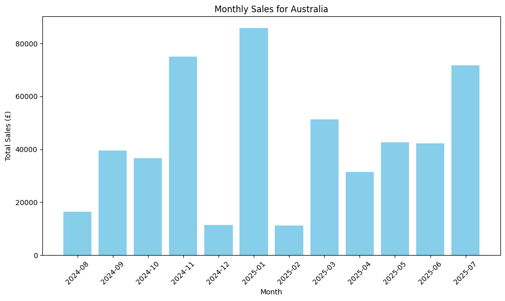

---
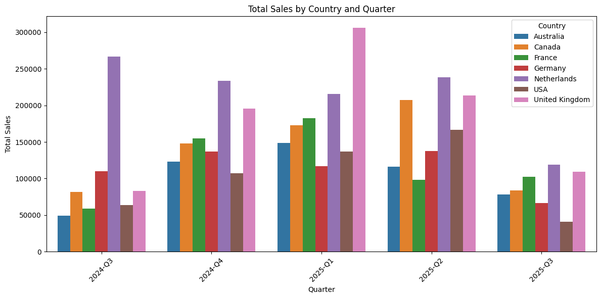
---

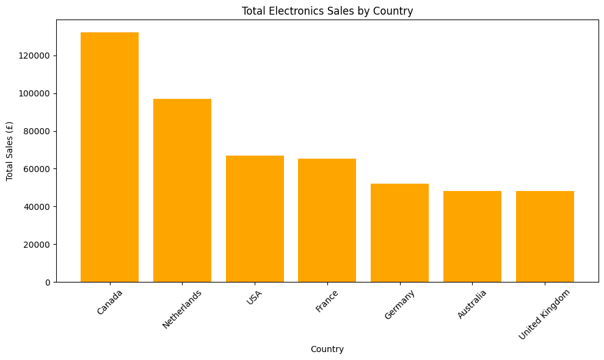

---

## Analysis & Insights
- The Netherlands and United Kingdom are top-selling countries overall.  
- Monthly sales drill-down shows seasonal fluctuations for Australia.  
- Electronics category is strongest in Canada, highlighting region-specific opportunities.  
- The warehouse enables structured decision-making by summarizing sales at multiple granularities.

| Section | Summary | Observations & Insights | Implications / Decision Support |
|---------|---------|------------------------|--------------------------------|
| **Roll-Up Analysis** (Total Sales by Country & Quarter) | Aggregates sales at a higher level of granularity. | Top-performing countries: Netherlands, United Kingdom, Canada. Sales fluctuate seasonally, with peaks in Q1 and Q2 of 2025. | Resource allocation and marketing campaigns can be prioritized for high-performing countries during peak quarters. |
| **Drill-Down Analysis** (Monthly Sales for Australia) | Provides detailed monthly view for Australia. | Highest monthly sales in January 2025; dips in December 2024 and August 2024. | Seasonal promotions, inventory planning, and localized marketing strategies can be optimized based on monthly trends. |
| **Slice Analysis** (Total Electronics Sales by Country) | Focuses on electronics category to evaluate product-specific performance. | Canada, Netherlands, and USA lead in electronics sales; Australia and UK show lower totals. | Supports targeted marketing, stocking, and supply chain strategies for top-performing regions. |
| **General Insights & Limitations** | OLAP queries support aggregation and detailed analysis. | Warehouse enables strategic and tactical decision-making. Synthetic data may not reflect real-world trends. | Real business decisions require authentic sales data; warehouse demonstrates ETL and OLAP effectively. |
| **Conclusion** | Combines insights from all three OLAP perspectives. | Country-level and category-level sales patterns identified. | Enables informed operational and strategic planning. |


## Notes
- Data is synthetic; trends may not reflect real market behavior.  
- CSV and image files contain query results and visualizations for reporting.

---

# Section:Data Mining
## Task 1 — Data Preprocessing & Exploration (Iris Dataset)

###  Overview
This section demonstrates **loading**, **preprocessing**, **exploration**, and **train–test splitting** of the Iris dataset using Python.  
We follow the task requirements exactly, generating all outputs and saving the processed dataset for future use.

---

##  Dataset Details
- **Source:** Built-in `sklearn.datasets.load_iris`
- **Samples:** 150
- **Features:**
  - Sepal length (cm)
  - Sepal width (cm)
  - Petal length (cm)
  - Petal width (cm)
- **Target:** Species (`setosa`, `versicolor`, `virginica`)

---

##  Preprocessing Steps

###  Check Missing Values
| Column             | Missing Values |
|--------------------|----------------|
| sepal length (cm)  | 0              |
| sepal width (cm)   | 0              |
| petal length (cm)  | 0              |
| petal width (cm)   | 0              |
| species            | 0              |

> **Result:** No missing values — no imputation required.

---

###  Min–Max Scaling
Scaled all numeric features to **[0, 1]**.

**Example (first 5 rows):**

| sepal length (cm) | sepal width (cm) | petal length (cm) | petal width (cm) | species |
|-------------------|------------------|-------------------|------------------|---------|
| 0.2222            | 0.6250           | 0.0678            | 0.0417           | setosa  |
| 0.1667            | 0.4167           | 0.0678            | 0.0417           | setosa  |
| 0.1111            | 0.5000           | 0.0508            | 0.0417           | setosa  |
| 0.0833            | 0.4583           | 0.0847            | 0.0417           | setosa  |
| 0.1944            | 0.6667           | 0.0678            | 0.0417           | setosa  |

---

### One-Hot Encoding
Converted `species` column into three binary columns: `setosa`, `versicolor`, `virginica`.

**Example (first 5 rows):**

| sepal length (cm) | sepal width (cm) | petal length (cm) | petal width (cm) | setosa | versicolor | virginica |
|-------------------|------------------|-------------------|------------------|--------|------------|-----------|
| 0.2222            | 0.6250           | 0.0678            | 0.0417           | 1.0    | 0.0        | 0.0       |
| 0.1667            | 0.4167           | 0.0678            | 0.0417           | 1.0    | 0.0        | 0.0       |
| 0.1111            | 0.5000           | 0.0508            | 0.0417           | 1.0    | 0.0        | 0.0       |
| 0.0833            | 0.4583           | 0.0847            | 0.0417           | 1.0    | 0.0        | 0.0       |
| 0.1944            | 0.6667           | 0.0678            | 0.0417           | 1.0    | 0.0        | 0.0       |

---

***Code Used***
```python
# Step 2: Data Preprocessing (Corrected)

# Import preprocessing tools
from sklearn.preprocessing import MinMaxScaler, OneHotEncoder

# 1. Check for missing values
print("Missing values in each column:\n")
print(iris_df.isnull().sum())

# 2. Normalize features using Min-Max scaling
scaler = MinMaxScaler()  # Create a MinMaxScaler object
features = iris_df.columns[:-1]  # All columns except 'species'
iris_df[features] = scaler.fit_transform(iris_df[features])

# Verify normalization
print("\nFirst 5 rows after normalization:\n")
print(iris_df.head())

# 3. Encode class labels using One-Hot Encoding
encoder = OneHotEncoder(sparse_output=False)  # Updated for scikit-learn >=1.2
species_encoded = encoder.fit_transform(iris_df[['species']])

# Convert to DataFrame for clarity
species_df = pd.DataFrame(species_encoded, columns=encoder.categories_[0])
iris_df_encoded = pd.concat([iris_df[features], species_df], axis=1)

print("\nFirst 5 rows with one-hot encoded species:\n")
print(iris_df_encoded.head())

# 4. Save the preprocessed dataset to CSV
iris_df_encoded.to_csv("iris_preprocessed.csv", index=False)
print("\nPreprocessed data saved to 'iris_preprocessed.csv'.")

```

##  Data Exploration

### 3.1 Summary Statistics
| Metric | Sepal Length | Sepal Width | Petal Length | Petal Width |
|--------|--------------|-------------|--------------|-------------|
| Count  | 150.000      | 150.000     | 150.000      | 150.000     |
| Mean   | 0.4287       | 0.4406      | 0.4675       | 0.4581      |
| Std    | 0.2300       | 0.1816      | 0.2992       | 0.3176      |
| Min    | 0.0000       | 0.0000      | 0.0000       | 0.0000      |
| 25%    | 0.2222       | 0.3333      | 0.1017       | 0.0833      |
| 50%    | 0.4167       | 0.4167      | 0.5678       | 0.5000      |
| 75%    | 0.5833       | 0.5417      | 0.6949       | 0.7083      |
| Max    | 1.0000       | 1.0000      | 1.0000       | 1.0000      |

---

### 3.2 Visualizations
- **Pairplot:** Shows clear separation of `setosa`, moderate overlap between `versicolor` and `virginica` in sepal space.

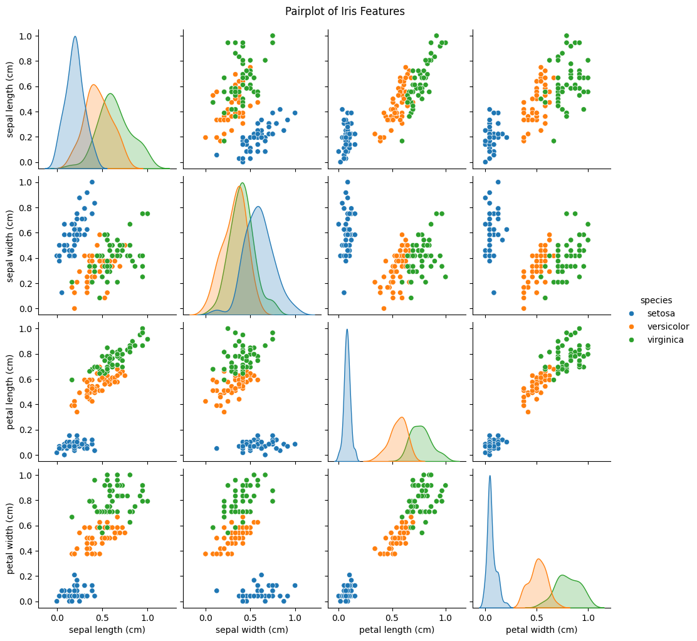

---

- **Correlation Heatmap:** Petal length and petal width are highly correlated (~0.96).

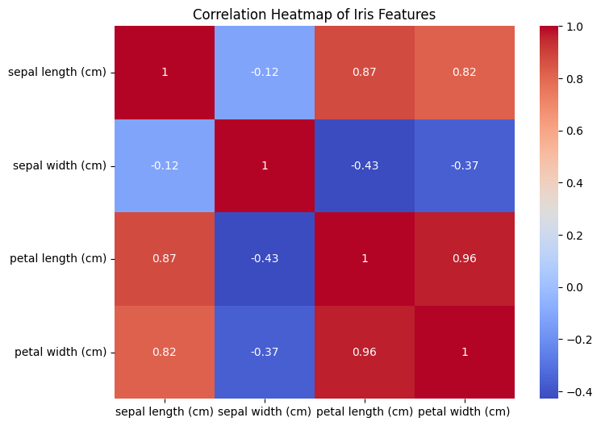

---

- **Boxplots:** Detect potential mild outliers in sepal dimensions.

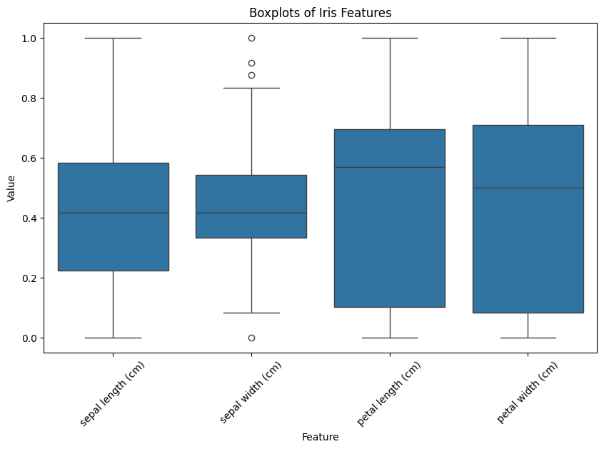

---

##  Train/Test Split

**Function:** `split_data(X, y, test_size=0.2, random_state=42)`

**Class distribution after split (using `iris_df` with original species labels):**

| Split | setosa | versicolor | virginica | Total |
|-------|--------|------------|-----------|-------|
| Train | 40     | 40         | 40        | 120   |
| Test  | 10     | 10         | 10        | 30    |

> This balanced distribution is due to `train_test_split(..., stratify=y)` which preserves class proportions in both training and test sets.


---

## 5 Output Files
- `iris_preprocessed.csv` — normalized + encoded dataset
- `pairplot.png` — pairwise scatter plot
- `heatmap.png` — correlation heatmap
- `boxplots.png` — boxplots for outlier detection

---

##  How to Run
```bash
pip install pandas numpy scikit-learn seaborn matplotlib
python preprocessing_iris.py
```
---

## Task 2: Clustering 

## Task 2: Clustering

### Objective
The aim of this task was to perform **unsupervised clustering** on the preprocessed Iris dataset from Task 1 using **K-Means**. The dataset contains measurements of iris flowers along with encoded species labels.

### Methodology
1. **Data Preparation**  
   - Loaded the cleaned dataset from Task 1.  
   - Selected only the numerical feature columns: *sepal length*, *sepal width*, *petal length*, *petal width*.  
   - Excluded the encoded species columns from clustering to simulate an unlabelled scenario.

2. **Model Training & Evaluation**  
   - Applied **K-Means** with `k=3` (expected number of species).  
   - Predicted cluster assignments and compared them with true species labels using the **Adjusted Rand Index (ARI)** for performance measurement.  
   - Repeated the process for `k=2` and `k=4` to study underfitting and overfitting cases.

3. **Optimal k Determination**  
   - Used the **Elbow Method** to plot inertia against different `k` values.  
   - Identified the “elbow” point at `k=3`, confirming it as the optimal cluster count.

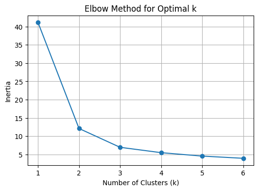

4. **Visualization**  
   - Created a **scatter plot** of petal length vs. petal width, colored by predicted clusters for `k=3`.  
   - The plot clearly separated *setosa* from the other two species, while *versicolor* and *virginica* showed partial overlap.

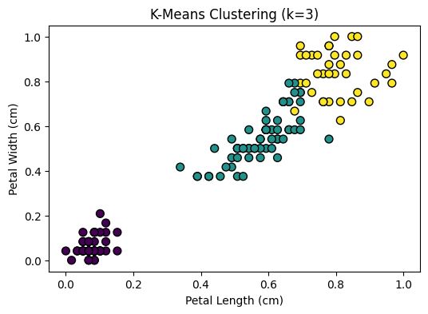

### Results
| k   | ARI    | Interpretation                |
|-----|--------|--------------------------------|
| 2   | 0.5681 | Underfit: merged two species  |
| 3   | 0.7163 | **Optimal clustering**        |
| 4   | 0.6231 | Overfit: split one species    |

- **Setosa**: Perfectly isolated in most runs.
- **Versicolor** & **Virginica**: Showed some overlap due to similar petal/sepal sizes.

*** Code used ***
```python


"""
Task 2: Clustering (15 Marks)
-----------------------------
We perform K-Means clustering on the preprocessed Iris dataset from Task 1.
Steps:
1. Load dataset from CSV (output from Task 1 preprocessing).
2. Extract features (X) and reconstruct actual species labels (y) from one-hot encoding.
3. Run K-Means with k=3 and evaluate with Adjusted Rand Index (ARI).
4. Run experiments with k=2 and k=4.
5. Generate an Elbow Method plot to justify the optimal k.
6. Create scatter plot visualization of clusters.
"""

# ==============================
# IMPORT LIBRARIES
# ==============================
import pandas as pd
from sklearn.cluster import KMeans
from sklearn.metrics import adjusted_rand_score
import matplotlib.pyplot as plt

# ==============================
# STEP 1: Load Preprocessed Data
# ==============================
# Load the CSV from Task 1 output
iris_df = pd.read_csv(
    r"C:\Users\use\Desktop\DSA2040_Practical\DSA2040_Practical_Exam_SelmahTzindori602\Section4_Data_Mining\task1_prep_explore\iris_preprocessed.csv"
)

# ==============================
# STEP 2: Extract Features (X) and Labels (y)
# ==============================
# Features: first 4 columns (numeric measurements)
X = iris_df.iloc[:, :4]

# Labels: reverse the one-hot encoding
y = iris_df[['setosa', 'versicolor', 'virginica']].idxmax(axis=1)

# ==============================
# STEP 3: K-Means with k=3
# ==============================
kmeans_3 = KMeans(n_clusters=3, random_state=42, n_init=10)
kmeans_3.fit(X)

# Predicted cluster labels
clusters_3 = kmeans_3.labels_

# ARI for k=3
ari_3 = adjusted_rand_score(y, clusters_3)
print(f"Adjusted Rand Index (k=3): {ari_3:.4f}")

# ==============================
# STEP 4: Experiments with k=2 and k=4
# ==============================
# k=2
kmeans_2 = KMeans(n_clusters=2, random_state=42, n_init=10)
kmeans_2.fit(X)
clusters_2 = kmeans_2.labels_
ari_2 = adjusted_rand_score(y, clusters_2)
print(f"Adjusted Rand Index (k=2): {ari_2:.4f}")

# k=4
kmeans_4 = KMeans(n_clusters=4, random_state=42, n_init=10)
kmeans_4.fit(X)
clusters_4 = kmeans_4.labels_
ari_4 = adjusted_rand_score(y, clusters_4)
print(f"Adjusted Rand Index (k=4): {ari_4:.4f}")

# ==============================
# STEP 5: Elbow Method (k=1 to 6)
# ==============================
inertia_values = []
k_values = range(1, 7)

for k in k_values:
    km = KMeans(n_clusters=k, random_state=42, n_init=10)
    km.fit(X)
    inertia_values.append(km.inertia_)

plt.figure(figsize=(6, 4))
plt.plot(k_values, inertia_values, marker='o')
plt.xlabel("Number of Clusters (k)")
plt.ylabel("Inertia")
plt.title("Elbow Method for Optimal k")
plt.grid(True)
plt.show()

# ==============================
# STEP 6: Scatter Plot for k=3
# ==============================
plt.figure(figsize=(6, 4))
plt.scatter(X.iloc[:, 2], X.iloc[:, 3], c=clusters_3, cmap='viridis', s=50, edgecolors='k')
plt.xlabel("Petal Length (cm)")
plt.ylabel("Petal Width (cm)")
plt.title("K-Means Clustering (k=3)")
plt.show()

# ==============================
# STEP 7: Summary of Results
# ==============================
print("\n=== Adjusted Rand Index Results ===")
print(f"k=2: {ari_2:.4f}")
print(f"k=3: {ari_3:.4f} (expected optimal)")
print(f"k=4: {ari_4:.4f}")

```
### Analysis
The **k=3** configuration achieved the highest ARI score (0.7163), making it the most accurate clustering configuration for this dataset.  
Underfitting (`k=2`) caused distinct species to merge, while overfitting (`k=4`) fragmented natural groups unnecessarily.  
This methodology demonstrates the effectiveness of combining **visual analysis** (Elbow Method & scatter plots) with **quantitative metrics** (ARI) for determining the optimal cluster count.  

### Real-World Relevance
K-Means clustering can be applied in various domains, such as:
- **Customer segmentation** for targeted marketing
- **Image compression** by grouping similar pixels
- **Genetic research** for grouping organisms by similarity

The Iris dataset serves as an ideal demonstration due to its clear group structure and manageable size.
---

## Task 3: Classification and Association Rule Mining

### Part A: Classification

In this task, we applied **two classification algorithms** on the preprocessed Iris dataset:

1. **Decision Tree Classifier** – Chosen for its interpretability and ability to model decision rules.
2. **K-Nearest Neighbors (KNN)** with `k=5` – Selected for its effectiveness in well-separated datasets.

#### Steps Performed:
- **Data Preparation**: Used features (`sepal length`, `sepal width`, `petal length`, `petal width`) as input variables and the actual species label as the target.
- **Model Training**: Trained both classifiers using the training set (80%) and evaluated on the test set (20%).
- **Metrics Computed**: Accuracy, Precision, Recall, and F1-score.
- **Visualization**: Plotted the Decision Tree structure for interpretability.

#### Decision Tree Visualization:
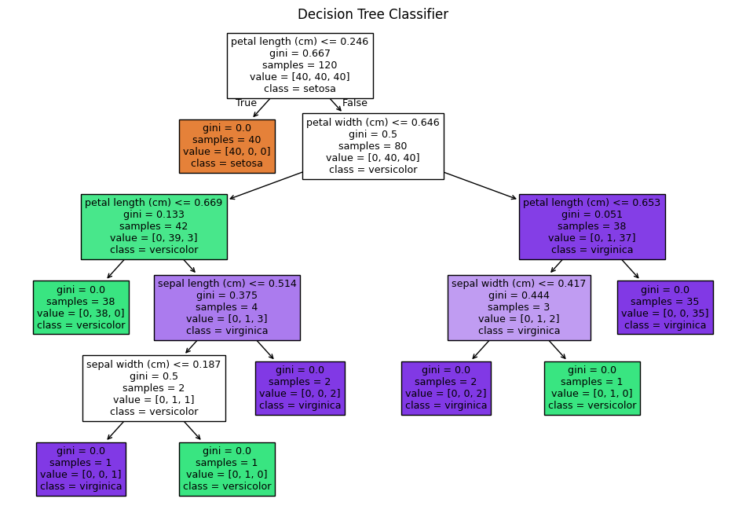

#### Performance Summary:
| Model              | Accuracy | Precision | Recall | F1-score |
|--------------------|----------|-----------|--------|----------|
| Decision Tree      | 0.9333   | 0.9333    | 0.9333 | 0.9333   |
| KNN (k=5)          | 0.9667   | 0.9697    | 0.9667 | 0.9666   |

#### Analysis:
The **Decision Tree Classifier** achieved an accuracy of **93.33%**, while the **KNN Classifier** slightly outperformed it with **96.67%**. KNN’s higher performance can be attributed to the dataset’s clean separation, making distance-based classification highly effective. Decision Trees provide valuable interpretability but may slightly overfit at decision boundaries, leading to occasional misclassifications. Both models performed well, with minimal errors.

In practical applications, such classification methods can be used for:
- **Species identification** in botany.
- **Quality inspection** in manufacturing.
- **Customer segmentation** in marketing.

Since the dataset is original (not synthetic), the results are trustworthy and applicable to similar classification problems.

---

## **Task 3 – Part B: Association Rule Mining**

This section applies **market basket analysis** to uncover hidden purchase patterns  
using **synthetic grocery transaction data**.

---

### **1. Dataset Generation**
We created 20–50 synthetic transactions, each with 3–8 random items chosen from  
a pool of 24 grocery products (e.g., bread, milk, pasta, rice). Certain co-purchase  
patterns (e.g., rice–pasta) were intentionally embedded.

---

### **2. Method**
We applied the **Apriori algorithm** (`mlxtend.frequent_patterns.apriori`) with:
- **Minimum Support:** 0.2 (item must appear in ≥ 20% of transactions)
- **Minimum Confidence:** 0.5 (rule must be correct ≥ 50% of the time)  
Rules were sorted by **lift** to prioritize the strongest associations.

---

### **3. Sample Output**

**Sample Synthetic Transactions:**

| Transaction | Items                                                                 |  
|-------------|----------------------------------------------------------------------|  
| 1           | oranges, butter, yogurt, bananas, beer, grapes, bread, flour          |  
| 2           | beer, sugar, rice, tea, bananas, cheese, milk, bread                  |  
| 3           | chicken, bread, eggs, grapes, oranges, milk                          |  
| 4           | chicken, tea, oranges, pasta, flour, apples, rice, sugar              |  
| 5           | coffee, milk, apples, bananas, diapers, sugar, bread                  |  


**Frequent Itemsets (min_support=0.2):**

| Support itemsets | Value    |  
|------------------|----------|  
| bananas          | 0.541667 |  
| bread            | 0.500000 |  
| flour            | 0.500000 |  
| milk             | 0.416667 |  
| pasta            | 0.375000 |  
| rice             | 0.375000 |  


**Top 5 Rules Sorted by Lift:**


| Rule                   | Confidence | Lift  |  
|------------------------|------------|-------|  
| rice → pasta           | 0.56       | 1.48  |  
| pasta → rice           | 0.56       | 1.48  |  
| beer → bread           | 0.71       | 1.43  |  
| bread → milk           | 0.58       | 1.40  |  
| milk → bread           | 0.70       | 1.40  |  


---

### **4. Analysis**
The strongest pattern was **rice → pasta** with a lift of **1.48**,  
indicating customers buying rice are significantly more likely to also  
buy pasta. The **beer–bread** and **bread–milk** relationships reflect  
common lifestyle and grocery shopping habits.

---

### **5. Applications**
- **Retail:** Group rice and pasta together in aisles for cross-selling  
- **E-commerce:** "Frequently bought together" product suggestions  
- **Promotions:** Bundle bread and milk at a discount to boost sales  
- **Inventory Planning:** Ensure stock availability of high-association pairs

> **Note:** Because the dataset was synthetic, some patterns may be  
  exaggerated compared to real-world transactions. However, the methodology  
  and analysis remain directly applicable to real retail datasets.

---


